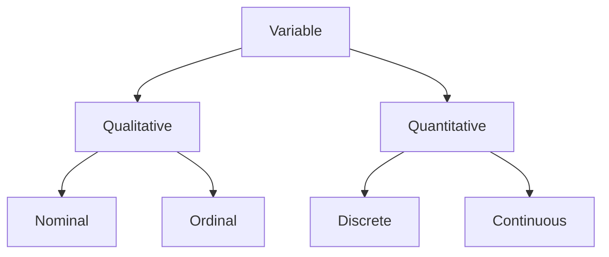

One of my main complaints when reading machine learning papers is the authors claiming that their method is "significantly" better than the rest just by doing a plain comparison with the magnitudes of the chosen metrics and highlighting them in bold. My issue is with the reporting standards that we have set: (i) most often the improvements are incremental (e.g. ~0.01), (ii) error intervals are not reported; even if they are, the top 3-5 methods lie within the error intervals of each other, and (iii) it is extremely rare to find results with appropriate significance testing. Unless I don't see statistical tests, how can I trust a particular approach to be "significantly" better than the rest? I am guilty of presenting results using only the best-in-bold approach myself, so I decided to write this post to highlight some recurring scenarios we come across when presenting results and what kind of statistical tests could be performed. Though it is tricky to decide which test(s) should be performed for your data, doing some significance testing could make your results look more credible. Note that this post only covers very specific tests and caters to only those categories of tests where 2 or more than 2 groups are involved (for e.g. comparing your model's performance against other baseline methods). For a detailed list that covers more cases, please refer to [this post](https://statsandr.com/blog/what-statistical-test-should-i-do/). 

### Variables

